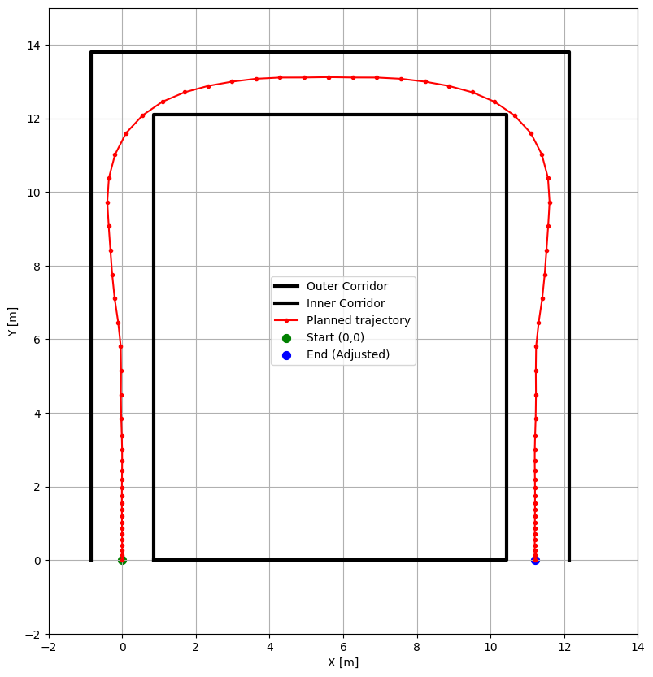
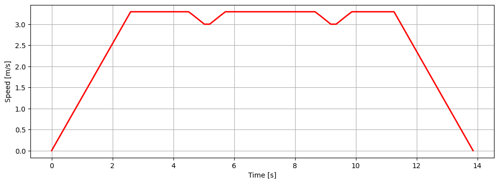
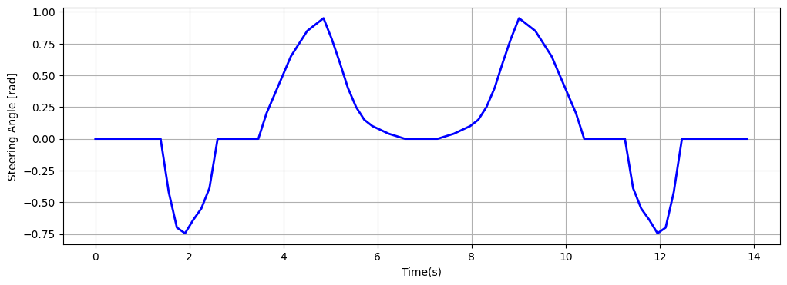

# Autonomous RC Car

## Introduction

In this project, I used a 4-wheel car model to simulate an RC car navigating through a corridor, using Sequential Convex Programming to find the most fuel-efficient path offline.  
I then built an RC car with a Jetson Orin AGX and a ZED2i camera. The ZED2i camera has built-in localization SLAM algorithms that, with visual sensing, can accurately estimate the car's position. 
Combined with the Jetson computer and ROS 2, the Jetson can send signals to an Adafruit controller, which then drives the servos and motor of the car using PWM to track the offline-calculated trajectory.

### 4-Wheel Car Model

This project uses a 4-wheel car model to simulate how a real RC car behaves while navigating a corridor.  
The 4-wheel model represents the four individual wheels (front and rear) and captures both steering and traction.  
To make simulation efficient, we often approximate it with a kinematic bicycle model:

- **Front axle:** Responsible for steering.
- **Rear axle:** Provides traction.
- **Key states:** position $(x, y)$, heading $\psi$, velocity $v$, and steering angle $\delta$.
- **Equations of motion:**
    - $\dot{x} = v \cos(\psi)$
    - $\dot{y} = v \sin(\psi)$
    - $\dot{\psi} = \frac{v}{L} \tan(\delta)$
    - $\dot{v} = a$

where $L$ is the wheelbase and $a$ is the acceleration.  
This model captures the essential behavior for turning, accelerating, and decelerating realistically while remaining computationally efficient for trajectory optimization and control.

### Sequential Convex Programming (Trajectory Planning)

We use Sequential Convex Programming (SCP) to compute the most fuel-efficient trajectory for the RC car within a corridor.  
SCP iteratively solves convexified subproblems around a trust region:

- **Convexified subproblems:**  
  We linearize the nonlinear vehicle dynamics around the current trajectory estimate.  
- **Trust region:**  
  A penalty term constrains how far the new trajectory can move from the previous one to ensure convergence.
- **Optimization goal:**  
  Minimize the total motor input (fuel usage) while ensuring the following constraints:
  - Motor and steering maximum/minimum values.
  - Vehicle speed limits ($v_{\min}$, $v_{\max}$).
  - Start and end position constraints.
  - Convex half-space (linear) constraints representing the corridor walls.
  - Maximum allowable centripetal acceleration (limits turning speed).

This formulation provides a computationally efficient and robust way to generate safe, dynamically feasible trajectories for the RC car.

### Results from Sequential Convex Programming (Trajectory Planning)

*Figure: The planned trajectory of the RC car within the corridor. The corridor walls are visible, and the red dots represent trajectory nodes at each discrete time step.*

*Figure: The speed profile of the RC car, showing acceleration to terminal velocity, cruising, and deceleration phases, along with speed dips during tight turns.*

*Figure: The steering angle vs. time plot shows how the car should steer in an ideal scenario. However, in the real world, actual steering inputs may differ due to disturbances and actuator limits.*

