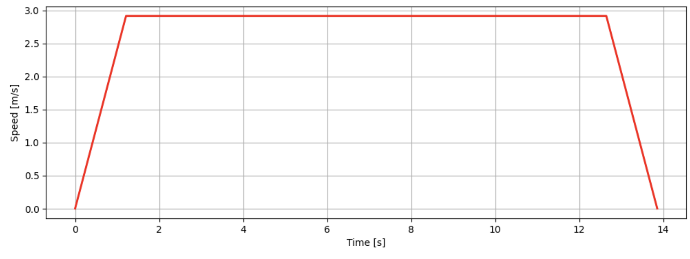
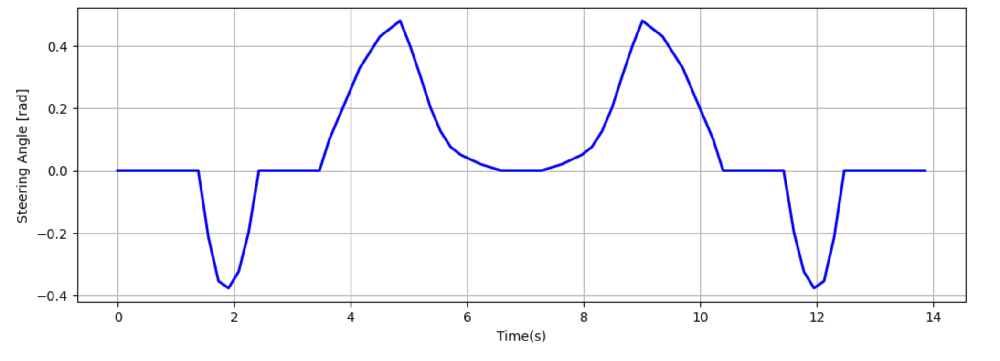
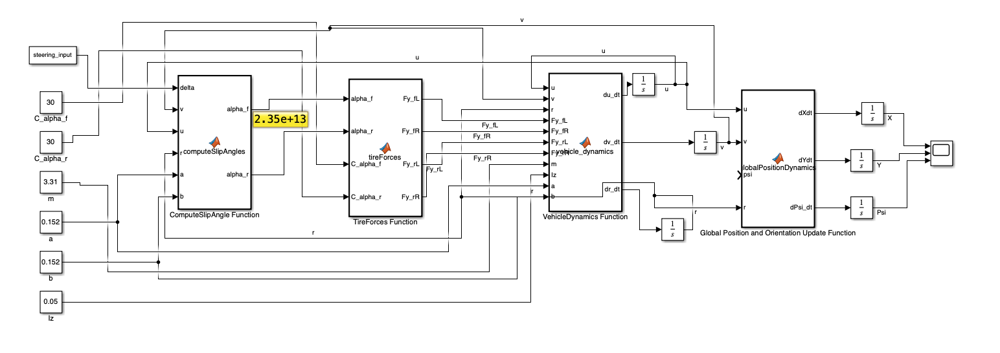
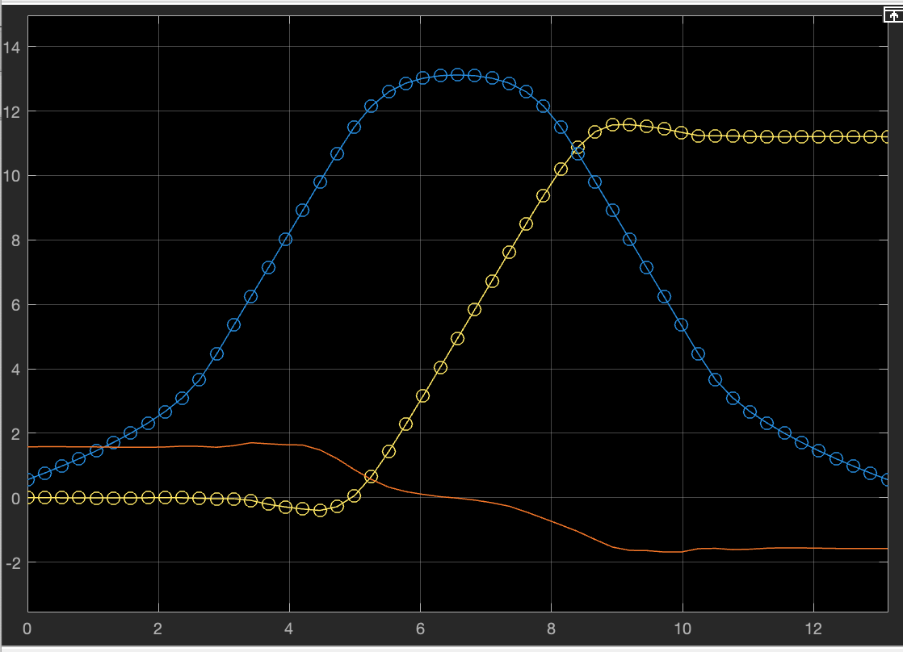

# Autonomous RC Car  (This is an unfinished project that is still in progress!)
## Introduction

In this project, A 4-wheel/ bicycle car model will be used to simulate an RC car navigating through a corridor. Uing Sequential Convex Programming we will find the most fuel-efficient path offline.  
I then built an RC car with a Jetson Orin AGX and a ZED2i camera. The ZED2i camera has built-in localization SLAM algorithms that, with visual sensing, can accurately estimate the car's position. 
Combined with the Jetson computer and ROS 2, the Jetson can send signals to an Adafruit controller, which then drives the servos and motor of the car using PWM to track the offline-calculated trajectory.
ROS 2 will attempt to track the trajectory using its 4-wheel/ bicycle car model.

*Figure: The physical build of the RC car is complete. I am currently addressing some software challenges.*

##  Detailed Bicycle Vehicle Dynamics Model

This projects implements a Detailed Bicycle vehicle dynamics model for an RC car, as our physical model, simulating the cars motion and stability while navigating real-world environments. It calculates the vehicle’s position, orientation, and velocity, taking into account the forces acting on all four wheels and realistic front steering input.

---

### Key Aspects

- **Four wheels**: While the vehicle has four tires, the model simplifies their effects by computing slip angles only for the front and rear axles—without distinguishing between left and right tires—effectively reducing it to a bicycle model.
- **Front steering**: Only the front wheels are actively steered (via the front steering angle). The rear wheels passively roll.  
- **Longitudinal and lateral forces**: Both forward (longitudinal) and sideways (lateral) tire forces are included.  
- **Yaw moment**: Accounts for how the car rotates around its center of mass (yaw motion).  

---

### Model Inputs

- Front steering angle (δ)
- Vehicle speed (longitudinal velocity)
- Tire slip angles (difference between wheel orientation and actual path)
- Vehicle mass and inertia
- Tire-road interaction (simple linear tire model or more advanced models)

---

### Model Outputs

- Vehicle global position and orientation (X, Y, ψ)
- Velocities (longitudinal, lateral, and yaw rate)
- Forces at each wheel (traction and lateral forces)

---

### Formulation

**Coordinate Frames & Variables**  
- Global frame: (X, Y) – fixed world coordinates  
- Body frame: (x, y) – attached to vehicle CoM  
- Yaw angle: ψ – vehicle heading angle  
- Longitudinal velocity: u – forward speed  
- Lateral velocity: v – sideways speed  
- Yaw rate: r = dψ/dt  

**Vehicle Equations of Motion**  
1️⃣ Longitudinal dynamics:  
    m (du/dt - v*r) = ΣFx  

2️⃣ Lateral dynamics:  
    m (dv/dt + u*r) = ΣFy  

3️⃣ Yaw motion:  
    Iz * (dr/dt) = a*(Fy_fL + Fy_fR) - b*(Fy_rL + Fy_rR)  

where:  
- m: vehicle mass  
- Iz: yaw moment of inertia  
- a, b: distances from CoM to front/rear axles  
- Fy_fL, Fy_fR: lateral forces at front-left/right wheels  
- Fy_rL, Fy_rR: lateral forces at rear-left/right wheels  

**Tire Slip Angles**  
- Front wheels:  
    α_f = δ - arctan((v + a*r)/u)  
- Rear wheels:  
    α_r = -arctan((v - b*r)/u)  

**Lateral Tire Forces (Linear Model)**  
    Fy_fL+Fy_fR = -Cα * α_f  
    Fy_rL+Fy_rR = -Cα * α_r  

where:  
- Cα: cornering stiffness  
- α: slip angle  

**Global Position Update**  
- dX/dt = u * cos(ψ) - v * sin(ψ)  
- dY/dt = u * sin(ψ) + v * cos(ψ)  
- dψ/dt = r
  

###  Load Transfer in the Vehicle

At rest (static loads):
F_zf = (m * g * b) / L  (each front tire gets half)
F_zr = (m * g * a) / L

where:
- L = a + b (wheelbase)
- a, b: distances from CoM to front/rear axle
- g: gravity

Each wheel:
F_zfL = F_zfR = F_zf / 2
F_zrL = F_zrR = F_zr / 2

 Dynamic Load Transfer (Lateral)
Due to lateral acceleration:
a_y = dv/dt + u * r
ΔF_z_roll = (m * h_cg * a_y * t) / L

where:
- h_cg: height of the CoM
- t: track width

Vertical loads on each wheel:
F_zfL = F_zf / 2 - (b / L) * ΔF_z_roll
F_zfR = F_zf / 2 + (b / L) * ΔF_z_roll
F_zrL = F_zr / 2 - (a / L) * ΔF_z_roll
F_zrR = F_zr / 2 + (a / L) * ΔF_z_roll

 Dynamic Load Transfer (Longitudinal)
ΔF_z_pitch = (m * h_cg * a_x) / L

where a_x is longitudinal acceleration.

Load shifts:
F_zf = (m * g * b) / L - ΔF_z_pitch
F_zr = (m * g * a) / L + ΔF_z_pitch

 Total Vertical Loads
F_z_wheel = F_z_static ± ΔF_z_roll ± ΔF_z_pitch

This formulation ensures accurate load calculations during cornering and acceleration for the RC car’s bicycle model.

### Simulation Steps
At each time step:  

1️⃣ Compute slip angles for each tire.  
2️⃣ Calculate lateral forces from slip angles.  
3️⃣ Calculate vertical loads on wheels (considering static load, dynamic lateral load transfer, and longitudinal load transfer).  
4️⃣ Adjust lateral tire forces using the updated vertical loads (affecting cornering stiffness).  
5️⃣ Update accelerations (`du/dt`, `dv/dt`, `dr/dt`).  
6️⃣ Integrate to get new velocities and yaw rate.  
7️⃣ Update global position and orientation (`X`, `Y`, `ψ`).

###  Assumptions & Limits
- Valid for low to moderate speeds (linear tire behavior)   
- No advanced tire models (like Pacejka) in the basic version  
- No load transfers are assumed for simplicity

### Sequential Convex Programming (Trajectory Planning)

We use Sequential Convex Programming (SCP) to compute the most fuel-efficient trajectory for the RC car within a corridor.  
SCP iteratively solves convexified subproblems around a trust region:

- **Convexified subproblems:**  
  We linearize the nonlinear vehicle dynamics around the current trajectory estimate.  
- **Trust region:**  
  A penalty term constrains how far the new trajectory can move from the previous one to ensure convergence.
- **Optimization goal:**  
  Minimize the total motor input (fuel usage) while ensuring the following constraints:
  - Motor and steering maximum/minimum values.
  - Vehicle speed limits ($v_{\min}$, $v_{\max}$).
  - Start and end position constraints.
  - Convex half-space (linear) constraints representing the corridor walls.
  - Maximum allowable centripetal acceleration (limits turning speed).

This formulation provides a computationally efficient and robust way to generate safe, dynamically feasible trajectories for the RC car.

## Controlling the Vehicle

To control the autonomous RC car along the precomputed trajectory, we plan to use either a **PID controller** or an **LQR (Linear Quadratic Regulator)**.

**PID Controller** – A straightforward approach that minimizes error based on proportional, integral, and derivative gains, would require design separate SISO PID Controllers for Each Input-Output Pair .  
**LQR Controller** – An optimal control approach that minimizes a quadratic cost function of state and control effort, providing a balance between tracking accuracy and control input magnitude, would work well in MIMO case.

For the LQR approach, we linearize the vehicle model around the current reference trajectory and compute time-varying feedback gains. This enables more robust tracking, especially in scenarios with high curvature turns or fast vehicle dynamics.

The chosen controller generates steering and motor commands (PWM) to track the precomputed path in real-time.  
This control algorithm will be implemented as a ROS 2 node, subscribing to localization data from the ZED 2i SLAM module and publishing PWM commands to the Adafruit PWM driver for steering and motor actuation.

### Results from Sequential Convex Programming (Trajectory Planning)

*Figure: The planned trajectory of the RC car within the corridor. The corridor walls are visible, and the red dots represent trajectory nodes at each discrete time step.*

*Figure: The speed profile of the RC car, showing acceleration to terminal velocity, cruising (saturation), and deceleration phases.*

*Figure: The steering angle vs. time plot shows how the car should steer in an ideal scenario. However, in the real world, actual steering inputs may differ due to disturbances and actuator limits.*

### Simulink Bicylce Car Model

ROS 2 can work seamlessly with Simulink, treating Simulink as nodes. To explore this capability, I implemented a Simulink model of the bicycle car dynamics, which also serves as an additional verification tool for the existing Python code.

*Figure:  Simulink diagram of the Bicylce car model, assuming a constant forward (saturation) velocity.*

*Figure: Scope output from the Simulink diagram above. The blue line represents the x position, the yellow line represents the y position, and the red line is the heading angle (yaw, ψ). This matches well with the Python plots when the forward velocity is at saturation .*
### Building an Autonomous RC Car

To build an autonomous RC car, you’ll need the following hardware components:

 **Jetson computer** (e.g., Jetson Orin AGX) – for real-time processing and control.  
 **ZED 2i camera** – for SLAM-based localization, enabling the car to understand its position in the environment.  
 **DC-DC converter** – to safely power the Jetson from a 4S LiPo battery.  
 **Adafruit 16-Channel 12-bit PWM/Servo Driver (I2C interface)** – generates precise PWM signals from the Jetson, which control the servos and brushless motor.  
 **I2C interface** – a communication protocol that allows multiple devices (sensors, PWM driver, etc.) to exchange data using just two wires (SDA and SCL).  
 **RC car hardware** – a chassis with a brushless motor, electronic speed controller (ESC), steering servo, and a battery to power the drivetrain.

This hardware setup provides a powerful and flexible platform to track and execute the precomputed trajectory, combining SLAM-based localization, real-time control, and hardware interfacing through I2C.

